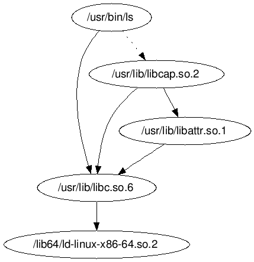

========================================
sograph - shared objects' graph
========================================

::

    +---------+  +-------------------------------+
    | GNU ldd |  | (Todo) directly read from ELF | ...
    +---------+  +-------------------------------+
        |                   |
        v                   v
    +-------------------------------------------+
    | dictionary of shared objects              |
    +-------------------------------------------+
        |
        v
     +-----+
     | DOT |
     +-----+

Example
========================================

.. code-block:: sh

    # on Arch Linux
    $ ./sograph.py ls
    digraph graphname {
        "/usr/bin/ls" -> "/usr/lib/libc.so.6"
        "/usr/lib/libattr.so.1" -> "/usr/lib/libc.so.6"
        "/usr/lib/libcap.so.2" -> "/usr/lib/libattr.so.1"
        "/usr/lib/libcap.so.2" -> "/usr/lib/libc.so.6"
        "/usr/lib/libc.so.6" -> "/lib64/ld-linux-x86-64.so.2"
        "/usr/bin/ls" -> "/usr/lib/libcap.so.2" [style=dotted]
    }

Result :

Todo
========================================

* [frontend] read shared objects dependency from ELF directly
    - like ``readelf -d /usr/bin/ls | grep NEEDED``
* use ``OrderedDict`` to make the result consistent
* [util] detect GNU ldd
* add more backend (other than DOT)
